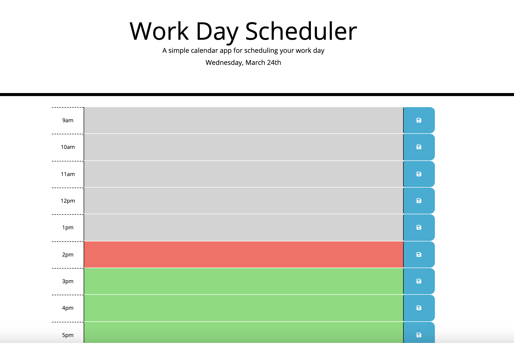

# work-day-scheduler

The following is a Work Day Scheduler, that is color-coded to indicate whether each timeblock is in the past (grey), present (red), or future (green).

When the user clicks into a timeblock, they wll be able to enter an event. When the user clicks the blue Save button, the event will be saved in local storage, and when the user refreshed the page, the saved event(s) will persist. 

Link to Work Day Scheduler: https://caitbopp.github.io/work-day-scheduler/

Preview of Work Day Scheduler:

